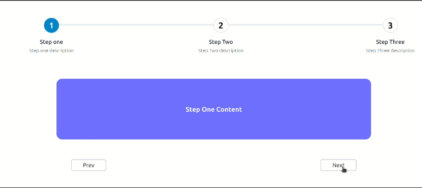

# React Multi Stepper

A lightweight, customizable, and reusable multi-stepper component for React.  
It allows you to create step-based workflows such as onboarding, multi-step forms, or guided processes with ease.

## 🎬 Demo



---

## 🚀 Features

- ✅ Easy to use and integrate into any React project  
- 🎨 Fully customizable step styles (active, completed)  
- ⚡ Built with **TypeScript** for type safety  
- 🧩 Includes context + hooks for flexible state management  
- 🧪 Tested with **Vitest** + **React Testing Library**  

---

## 📦 Installation

```bash
npm install react-multi-stepper
# or
yarn add react-multi-stepper
```

---

## 🔨 Usage

```javascript
import React from "react";
import { MultiStepper } from "react-multi-stepper";

const steps = [
  { title: "Step 1", description: "Personal Info", active: true, completed: false },
  { title: "Step 2", description: "Address Details", active: false, completed: false },
  { title: "Step 3", description: "Review", active: false, completed: false },
];

export default function App() {
  const handleNext = (currentStep:number) => {
    console.log("Next step clicked",currentStep);
  };

  return (
    <MultiStepper steps={steps} onClickNext={handleNext} />
  );
}
```

---

## 🧩 API Reference

### MultiStepper Props

| Prop          | Type         | Required | Description                                                    |
| ------------- | ------------ | -------- | -------------------------------------------------------------- |
| `steps`       | `StepType[]` | ✅        | Array of steps (`title`, `description`, `active`, `completed`) |
| `onClickNext` | `(currentStep:number) => void` | ✅        | Callback triggered when the "Next" button is clicked           |